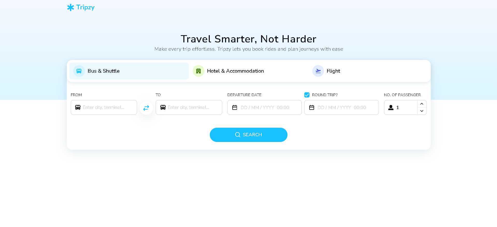
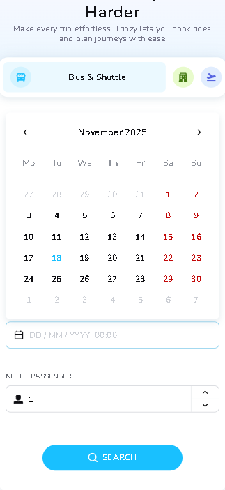

# Tripzy Frontend Test

[](https://tripzyfrontendtestphanthanhhoan.vercel.app/)

<p align="center">
  
  <br>
  <em>Figure 1: Desktop screen</em>
</p>

<p align="center">
  
  
  <br>
  <em>Figure 2: Mobile screen</em>
</p>

## 🚀 Quick Start

### Prerequisites

-   **Node.js:** version 18.17.0 or higher (recommended 20.x)
-   **Package Manager:** npm

### Installation & Development

```bash
# Clone the repository
git clone https://github.com/thanhhoan12390/tripzy-frontend-test-phan-thanh-hoan.git
cd tripzy-frontend-test-phan-thanh-hoan

# Install dependencies (using npm)
npm install

# Start the development server
npm run dev
```

Open [http://localhost:3000](http://localhost:3000) with your browser to see the result.

## 🏗️ Architecture & Tech Stack

### Core Technologies

-   **Next.js 15:** React framework with App Router
-   **React 19:** latest React with new features
-   **TypeScript:** type safety and better developer experience
-   **Turbopack:** high-performance bundler for faster builds

### UI & Styling

-   **AntD:** React UI library,
-   **Sass:** CSS preprocessor for advanced styling
-   **normalize.css:** modern CSS reset
-   **classnames:** utility for conditional className handling

### Development & Quality

-   **ESLint:** code linting with latest config
-   **TypeScript:** static type checking

### Validation

-   **Zod:** schema validation for runtime type safety

## 🎯 Key Technical Decisions

-   **Next.js 15 with Turbopack:** chosen for exceptional development performance and production-ready features like SSR, SSG, and API routes.
-   **React 19:** utilizes the latest React features including actions, directives, and improved performance.
-   **Ant Design:** implement smart Autocomplete with Ant Design's AutoComplete component for real-time search suggestions.
-   **Implemented custom components:** (e.g., CustomDatePicker, InputNumber, Tabs) to ensure consistent styling and improve reusability across the UI.
-   **Server Action:** handle form validation and server-side redirect, simplifying client logic and enhancing overall reliability.
-   **Zod:** provides robust runtime validation complementing TypeScript's compile-time checking.

## 🔗 Live Demo

Check out the live application deployed on Vercel: [https://tripzyfrontendtestphanthanhhoan.vercel.app](https://tripzyfrontendtestphanthanhhoan.vercel.app)
